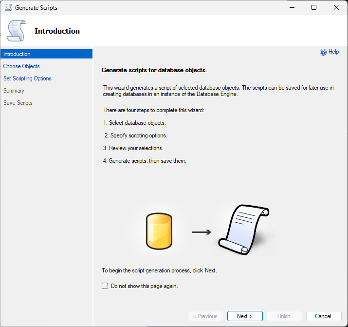

<p align="center">
  
</p>

<h3 align="center">:weight_lifting: ASP.Net MVC and Bootstrap Frameworks for Developing Web Applications</h3>

<p align="center">
  Welcome to the ASP.Net MVC and Bootstrap seminar/training.
</p>

## :wrench: Requirements
- [x] 1. Visual Studio Community 2022
  - [Download Link](https://visualstudio.microsoft.com/vs/community/)
- [x] 2. SQL Server Management Studio (SSMS)
  - [Donwload Link](https://learn.microsoft.com/en-us/sql/ssms/download-sql-server-management-studio-ssms?view=sql-server-ver16)
- [x] 3. SQL Server Management Studio Express
  - [GUIDE](https://www.sqlshack.com/how-to-install-sql-server-express-edition/)
  - [Download Link](https://www.microsoft.com/en-us/sql-server/sql-server-downloads)
- [x] 4. [Somee](https://somee.com/doka) account
- [ ] 5. GitHub Account (Not Required but good to have)

# :clock10: First Session

<p align="center">
  
  
</p>

<h3 align="center">1st Session - ASP.NET MVC and Bootstrap/Bootswatch</h3>

<p align="center">
  We'll spend our first session learning about visual studio, ASP.NET MVC and how to implement bootstrap
  <br>
</p>

## :bulb: Scope
- [x] :wrench: I. Installing Visual Studio
  - Selecting the right packages and plugins
- [x] :test_tube: II. Creating your first ASP.NET MVC solution
  - Exploring ASP.NET MVC solution
- [x] :art: III. Implementing [Bootstrap/Bootswatch](https://bootswatch.com/3/)
- [x] :page_facing_up: IV. Customizing a page
- [x] :scroll: V. Creating new page

## :wrench: I. Installing Visual Studio
- [ ] Download and install [Visual Studio Community 2022](https://visualstudio.microsoft.com/vs/community/)
- [ ] After installing, open Visual Studio Installer 

  

- [ ] Modify your Visual Studio Comunity 2022

  

- [ ] Check ASP.NET web development, Data storage processing

  
  

- [ ] Go to Individual Components and check ".NET Framework 4.7.2 SDK" and ".NET Framework 4.7.2 targeting pack" then click modify 

  


## :test_tube: II. Creating your first ASP.NET MVC solution
> For this example, we'll be creating a web site application for this seminar. We'll be adding our seminar poster into our application and use bootstrap to design it.

- [ ] Open Visual Studio and click on "Create a new project"

  
  

- [ ] Select ASP.NET Web Application (.Net Framework) and click next

  

- [ ] Create a name for your solution and click create
  > :warning: Note: Framework should be ".NET Framework 4.7.2"

  

- [ ] Select MVC and hit Create

  

- [ ] Wait for the creation of your new solution to open before pressing F5 or selecting the IIS Express option at the window's top to run your solution.

  

- [ ] After Executing your solution, your web application will be automatically open in your selected browser.

  

### :bus: MVC TOUR
> The MVC architectural pattern has existed for a long time in software engineering. All most all the languages use MVC with slight variation, but conceptually it remains the same.

>MVC stands for Model, View, and Controller. MVC separates an application into three components - Model, View, and Controller.

<p align="center">
  
</p>

- **Model:** Model represents the shape of the data. A class in C# is used to describe a model. Model objects store data retrieved from the database. **Model represents the data.**

- **View:** View in MVC is a user interface. View display model data to the user and also enables them to modify them. View in ASP.NET MVC is HTML, CSS, and some special syntax (Razor syntax) that makes it easy to communicate with the model and the controller. **View is the User Interface.**

- **Controller:** The controller handles the user request. Typically, the user uses the view and raises an HTTP request, which will be handled by the controller. The controller processes the request and returns the appropriate view as a response. **Controller is the request handler.**

## :art: III. Implementing [Bootstrap/Bootswatch](https://bootswatch.com/3/)
> It's quite simple to change the web application's theme. You can use a variety of free and downloadable CSS files that are available online.

>We'll modify our website's bootstrap theme as an example. Go to the bootstrap.min.css file in the Content folder to check the bootstrap version first. In this instance, bootstrap 3.4.1 is used in our solution.

> [You will be taken to the bootstrap version 3.4.1 after clicking this](https://bootswatch.com/3). You can obtain the CSS for your chosen theme from this website.

> Download the bootstrap.css and bootstrap.min.css and paste it on your Content folder. Note: These file name are already existing in this folder, Overwrite it to proceed changing the theme.

> Execute your solution.
  

## :page_facing_up: IV. Customizing a page
> We need to modify the home page and add the image of the seminar.

> Go to Views/Home/Index.cshtml and add the image code

```diff
@{
    ViewBag.Title = "Home Page";
}

<div class="jumbotron" style='background-image: url("~/Image/poster.png")'>
    <h1>ASP.NET MVC And Bootstrap for developing Web Applications</h1>
    <p class="lead">Welcome to ASP.NET MVC and Bootstrap Seminar</p>
    <p><a href="https://asp.net" class="btn btn-primary btn-lg">Learn more &raquo;</a></p>
</div>
+ 
```

> Code to add image in cshtml

```html

```

## :scroll: V. Creating new page
> Follow these instructions to create a new page in MVC.

- [ ] You'll locate the solution explorer on the right side of your visual studio. Right-click the "Controller" folder, select Add, and then select Controller.

  

- [ ] A new form will popup. Select MVC 5 Controller - Empty and click Add.

  

- [ ] Type in your controller's name. The text "[CHANGEME]" should be changed to your initials. Hit Enter and wait for your new controller to load.

  

  ```cs
  using System;
  using System.Collections.Generic;
  using System.Linq;
  using System.Web;
  using System.Web.Mvc;

  namespace [CHANGEMETOPROJECTNAME].Controllers
  {
      public class [CHANGEMETOCONTROLLERNAME]Controller : Controller
      {
          // GET: JLEPage
          public ActionResult Index()
          {
              return View();
          }
      }
  }
  ```

- [ ] On your controller, right click inside the index method and click add view.

  

- [ ] Select MVC 5 View and click add

  

- [ ] New window will open. Set your view name to "Index" and click add. 

  

- [ ] Wait for the new view to load.

  ```cshtml
  
  @{
      ViewBag.Title = "Index";
  }

  <h2>Index</h2>
  ```
  
# :mechanic: Activity

  - [ ] Install Visual Studio.
  - [ ] Create new ASP.NET Web Application (.Net Framework) solution.
  - [ ] Implement bootstrap in your project.
  - [ ] Create your own page.
    - [ ] New Controller
    - [ ] New View
    - [ ] Create new hyperlink in navigation for your new page.


# :clock2: Second Session

<p align="center">
  
</p>

<h3 align="center">2nd Session - ASP.NET MVC and Bootstrap/Bootswatch</h3>

<p align="center">
  For the second session, Databases (tables, stored procedures, etc) and deploying visual studio solution and database to somee.com.
</p>

## :bulb: Scope
- [x] :hammer_and_wrench: I. Installing SSMS and SSMS Express
- [x] :minidisc: II. Creating new datase using SQL Sever Management Studio
- [x] :arrows_clockwise: III. Connecting your web application to your database.
- [x] :computer: IV. Displaying and manipulating data from database to web application
- [x] :arrow_double_up: V. Deploying your web application to somee.

## :hammer_and_wrench: I. Installing SSMS and SSMS Express
- [ ] You must first install SSMS (SQL Server Management Studio) in order to start managing databases. 
  [Donwload SSMS](https://learn.microsoft.com/en-us/sql/ssms/download-sql-server-management-studio-ssms?view=sql-server-ver16) and install.

- [ ] You must also install SSMS Express.
  - [ ] [GUIDE](https://www.sqlshack.com/how-to-install-sql-server-express-edition/) : Follow this guide to install SSMS Express. 
    
    >:exclamation: NOTE : Use the basic Installation Type.
    
    

  - [ ] [Download Link](https://www.microsoft.com/en-us/sql-server/sql-server-downloads)

- [ ] After installing SSMS and SSMS Express. open your SSMS by typing "SSMS" in your windows search.
  
  

- [ ] SSMS will require you to connect to your database. Select the drop down on your SQL Server window and select "Browse for more".
  
  

- [ ] Collapse the database engine and select any server under it and click "ok".
  
  

- [ ] Click connect on your SQL Server window
  
  
  
> Congrats, you are currently logged into your local machine's database.

:minidisc: II. Creating new datase using SQL Sever Management Studio
- [ ] On your SSMS, right click the Databases and click New Datase.
  
  

- [ ] Create a name for your database and click "OK"

  

- [ ] Creating new table in your database.

```sql
CREATE TABLE [dbo].[tblnames](
	[NameID] [int] IDENTITY(1,1) NOT NULL,
	[firstname] [nvarchar](50) NULL,
	[lastname] [nvarchar](50) NULL,
	[CreatedDate] [datetime] NULL
) ON [PRIMARY]
GO
```

- [ ] Inserting data in table

```sql
-- ENABLE INSRTING OF ID
SET IDENTITY_INSERT [dbo].[tblnames] ON 

-- SCRIPT TO INSERT DATA
INSERT [dbo].[tblnames] ([NameID], [firstname], [lastname], [CreatedDate]) VALUES (1, N'Juan', N'Dela Cruz', CAST(N'2023-03-20T14:33:48.793' AS DateTime))
INSERT [dbo].[tblnames] ([NameID], [firstname], [lastname], [CreatedDate]) VALUES (2, N'John', N'Doe', CAST(N'2023-03-20T15:23:54.870' AS DateTime))
```

- [ ] Selecting data in table

```sql
-- GET ALL THE DATA IN TBLNAMES
SELECT * FROM TBLNAMES
```
- OUTPUT

  

- [ ] Deleting data in table

```sql
DELETE [CHANGEME_TO_TABLE_NAME] WHERE 1=1

-- DELETE DATA IN TBLNAMES
DELETE [DBO].[TBLNAMES] WHERE [FIRSTNAME] = 'Jomiel'
```

## :arrows_clockwise: III. Connecting your web application to your database.
> We will now link our web application to the newly built database.

- [ ] Open your Project on your Visual Studio.

- [ ] Go to your solution explorer, right click on Model, click add and click new item.

  

- [ ] Under C#, click Data, select ADO.NET Entity Data Model and add name for your database model then click add.

  

- [ ] Select EF Designer from database and click next.

  

- [ ] Click new connection

  

- [ ] Enter server name. You can check your server name in your SSMS

  

  - [ ] Go to SSMS and copy the server name and paste it to visual studio connection properties

    

  - [ ] Paste the server name, select database name and click OK.

    

- [ ] Your entity data model wizard will be automatically updated. Click next.

  

- [ ] Select Entity Framwork 5.0 and click next

  

- [ ] Put a check on tables and click finish.

  

- [ ] The model you can see below will be created.

  

> Congratulations, your web application and database are now connected.

## :computer: IV. Displaying and manipulating data from database to web application
 > We will now display the data from the database table "tblname" to the page that we previously created. 

- [ ] Go to solution explorer on your visual studio and open the controller that you created.

  

- [ ] Modify the code on your controller

  ```diff
  using System;
  using System.Collections.Generic;
  using System.Linq;
  using System.Web;
  using System.Web.Mvc;
  + // Code to include your data model that you previously created
  + using LearningMVC.Models;

  namespace LearningMVC.Controllers
  {
      public class JLEPageController : Controller
      {
          // GET: JLEPage
          public ActionResult Index()
          {
  +            // Instantiate the database Entity
  +            MVCSEMINARDBEntities MVC = new MVCSEMINARDBEntities();

  +            // get all the data from your database tblname
  +            var data = from name in MVC.tblnames select name;
  -            return View();
  +            // return the view with the data
  +            return View(data);
          }
      }
  }
  ```

- [ ] Go to the view of this method by right clicking the method and clicking the "Go to View".

- [ ] Modify your View Page

```diff
+ @model IEnumerable<[CHANGEME].Models.tblname>
@{
    ViewBag.Title = "Index";
}

<h2>Index</h2>

+ @* Code to display data on tblnames*@
+ @foreach([CHANGEME].Models.tblname names in Model)
+ {
+    // Display firstname each row
+    <h1>@names.firstname</h1>
+ }
```

- [ ] Displaying tblnames in a table

  ```cshtml
  <table class="table table-striped table-hover">
      <thead>
          <tr>
              <td>ID</td>
              <td>First Name</td>
              <td>Last Name</td>
          </tr>
      </thead>
      <tbody>
          @foreach ([CHANGEME].Models.tblname names in Model)
          {
              
              <tr>
                  <td>@names.NameID</td>
                  <td>@names.firstname</td>
                  <td>@names.lastname</td>
              </tr>
          }
      </tbody>
  </table>
  ```

### Creating add function for your names table
- [ ] Create new storedprocedure. Storedprocedure is like a function that you can execute to modify the datas in your database. In this part, we will create a storedprocedure that we can execute from our web application to insert new name on the the tblnames.

- [ ] Open your SSMS again and press CTRL+N to open a new query window and paste the code below.
> Code to create insert name storedprocedure.
  ```sql
  CREATE  procedure [dbo].[sp_insert_name]
    @fname nvarchar(50),
    @lname nvarchar(50) 
  as
  begin

    insert into tblnames
      (
        firstname, 
        lastname, 
        CreatedDate
      )
      values(
        @fname,
        @lname,
        getdate()
      )

  end
  ```

- [ ] Go now to your visual studio and create new folder with the name "Repository"
  > In your solution explorer, right click on the project name and click "Add" then "New Folder". Put "Repository" as the name of the folder.

- [ ] Right-click on that folder, select "Add," then select "Class," to add a new class. Put "NamesRepository" as the name of the class.

> Add the following code to NamesRepository.cs. The name of your database model should be used in place of the text "[CHANGEME]".
  ```cs
  using System;
  using System.Collections.Generic;
  using System.Configuration;
  using System.Data.SqlClient;
  using System.Linq;
  using System.Web;
  using System.Data;
  using System.Data.EntityClient;

  namespace LearningMVC.Repository
  {
      public class NamesRepository
      {
          static string connstring = ConfigurationManager.ConnectionStrings["[CHANGEME]Entities"].ConnectionString;
          static string providerString = new EntityConnectionStringBuilder(connstring).ProviderConnectionString;
          SqlConnection conn = new SqlConnection(providerString);
          public string saveName(string fname, string lname)
          {
              try
              {
                  SqlCommand cmd = new SqlCommand("sp_insert_name", conn);
                  cmd.CommandType = CommandType.StoredProcedure;
                  cmd.Parameters.AddWithValue("@fname", fname);
                  cmd.Parameters.AddWithValue("@lname", lname);
                  conn.Open();
                  cmd.ExecuteNonQuery();
                  conn.Close();
                  return "Success";
              }
              catch {
                  return "Error";
              }
          }
      }
  }
  ```

- [ ] Modify your controller and create a new page for adding new name.

```cs
// paste this code in your controller.
public ActionResult Add()
{
    return View();
}
```

- [ ] Right click on the new action result and click add view.

```cshtml
@model [CHANGEMEOTPROJECTNAME].Models.tblname
@{
    ViewBag.Title = "Add";
}

@using (Html.BeginForm("AddName", "[CHANGEMETOCONTROLLERNAME]", FormMethod.Post, new { @class = "form-horizontal" }))
{
    <fieldset>
        <legend><h2>Add</h2></legend>
        <div class="form-group">
            <label for="inputEmail" class="col-lg-2 control-label">First Name: </label>
            <div class="col-lg-10">
                @Html.TextBoxFor(model => model.firstname, new { @class = "form-control" })
            </div>
        </div>
        <div class="form-group">
            <label for="inputEmail" class="col-lg-2 control-label">Last Name</label>
            <div class="col-lg-10">
                @Html.TextBoxFor(model => model.lastname, new { @class = "form-control" })
            </div>
        </div>
        <div class="form-group">
            <div class="col-lg-10 col-lg-offset-2">
                <button type="submit" class="btn btn-success">Add</button>
            </div>
        </div>
    </fieldset>
}
```

- [ ] In your controller, create a new method for adding new names.

```cs
// Code for adding new names
[HttpPost]
public ActionResult AddName(tblname names)
{
  // instantiate NamesReposity
  NamesRepository namesRepository = new NamesRepository();
  // Call the saveName Method in NamesRepository
  string test = namesRepository.saveName(names.firstname, names.lastname);
  // redirect to index page after inserting new name
  return RedirectToAction("Index");
}
```

### Delete function for tblnames

- [ ] Create new storedprocedure of delete function

> copy the script below and paste it to ssms query and execute.

  ```sql
  CREATE PROCEDURE [dbo].[sp_delete_name]
    @id int
  AS
  BEGIN
    DELETE tblnames WHERE NameID = @ID
  END
  ```
- [ ] Modify "NamesRepository.cs". Add the method below

  ```cs
  public string deleteName(int id)
  {
    try
    {
      SqlCommand cmd = new SqlCommand("sp_delete_name", conn);
      cmd.CommandType = CommandType.StoredProcedure;
      cmd.Parameters.AddWithValue("@ID", id);
      conn.Open();
      cmd.ExecuteNonQuery();
      conn.Close();
      return "Success";
    }
    catch
    {
      return "Error";
    }
  }
  ```

- [ ] Paste the code below on your controller.

```cs
public ActionResult Delete(int id)
{
  // Instantiate NamesRepository
  NamesRepository namesRepository = new NamesRepository();
  // Execute delete function on NamesRepository
  string test = namesRepository.deleteName(id);

  // Redirect to index page of your repository
  return RedirectToAction("Index");
}
```

- [ ] Modify the index view of your controller.

```diff
@model IEnumerable<LearningMVC.Models.tblname>
@{
    ViewBag.Title = "Index";
}

<h2>Index</h2>

@* Code to display data on tblnames*@
@*@foreach (LearningMVC.Models.tblname names in Model)
    {
        // Display firstname each row
        <h1>@names.firstname</h1>
}*@

@Html.ActionLink("Add", "Add", "JLEPage", new { @class="btn btn-primary"})

<table class="table table-striped table-hover">
    <thead>
        <tr class="info">
            <td>ID</td>
            <td>First Name</td>
            <td>Last Name</td>
+            <td>Action</td>
        </tr>
    </thead>
    <tbody>
        @foreach (LearningMVC.Models.tblname names in Model)
        {

            <tr>
                <td>@names.NameID</td>
                <td>@names.firstname</td>
                <td>@names.lastname</td>
+                <td><a href="@Url.Action("Delete","JLEPage", new { id = names.NameID })" class="btn btn-danger">Delete</a></td>
            </tr>
        }
    </tbody>
</table>
```
### Edit/Update function for tblnames

- [ ] Create new stored procedure for edit function

```sql
-- script for creating update name stored procedure
CREATE PROCEDURE [dbo].[sp_update_name]
	@id int,
	@fname nvarchar(50),
	@lname nvarchar(50)
AS
BEGIN
	update tblnames set firstname=@fname, lastname=@lname where NameID=@id
END
```

- [ ] Modify NamesRepository and add the code below.

```cs
public string updateName(tblname names)
{
  try
  {
    SqlCommand cmd = new SqlCommand("sp_update_name", conn);
    cmd.CommandType = CommandType.StoredProcedure;
    cmd.Parameters.AddWithValue("@id", names.NameID);
    cmd.Parameters.AddWithValue("@lname", names.lastname);
    cmd.Parameters.AddWithValue("@fname", names.firstname);
    conn.Open();
    cmd.ExecuteNonQuery();
    conn.Close();
    return "Success";
  }
  catch
  {
    return "Error";
  }
}
```

- [ ] Modify your controller. Copy the changes below.

```diff
using System;
using System.Collections.Generic;
using System.Linq;
using System.Security.Cryptography;
using System.Web;
using System.Web.Mvc;
using LearningMVC.Models;
using LearningMVC.Repository;

namespace LearningMVC.Controllers
{
  public class JLEPageController : Controller
  {
    // GET: JLEPage
    public ActionResult Index()
    {
      MVCSEMINARDBEntities MVC = new MVCSEMINARDBEntities();

      var data = from name in MVC.tblnames.OrderBy(x => x.NameID) select name;

      return View(data);
    }

-    public ActionResult Add()
+    public ActionResult Add(int? id)
    {
+      tblname name =new tblname();
+
+      if(id != null)
+      {
+        MVCSEMINARDBEntities MVC = new MVCSEMINARDBEntities();
+        var selectedName = from names in MVC.tblnames.Where(x => x.NameID == id) select names;
+
+        name = (tblname)selectedName.First();
+      }
+           
+      return View(name);
-      return View();
    }

    [HttpPost]
    public ActionResult AddName(tblname names)
    {
      // instantiate NamesReposity
      NamesRepository namesRepository = new NamesRepository();
-      // Call the saveName Method in NamesRepository
-      string test = namesRepository.saveName(names.firstname, names.lastname);
+      if (names.NameID != 0)
+      {
+        string test = namesRepository.updateName(names);
+      }
+      else
+      {
+        // Call the saveName Method in NamesRepository
+        string test = namesRepository.saveName(names.firstname, names.lastname);
+      }
      // redirect to index page after inserting new name
      return RedirectToAction("Index");
    }

    public ActionResult Delete(int id)
    {
      NamesRepository namesRepository = new NamesRepository();
      string test = namesRepository.deleteName(id);
      return RedirectToAction("Index");
    }
  }
}
```

- [ ] Modify the Index page of your controller.

```diff
@model IEnumerable<LearningMVC.Models.tblname>
@{
    ViewBag.Title = "Index";
}

<h2>Names</h2>

@Html.ActionLink("Add", "Add", "JLEPage", new { @class = "btn btn-primary" })

<table class="table table-striped table-hover">
  <thead>
    <tr class="info">
      <td>ID</td>
      <td>First Name</td>
      <td>Last Name</td>
      <td>Action</td>
    </tr>
  </thead>
  <tbody>
    @foreach (LearningMVC.Models.tblname names in Model)
    {
      <tr>
        <td>@names.NameID</td>
        <td>@names.firstname</td>
        <td>@names.lastname</td>
        <td>
          <a href="@Url.Action("Delete","JLEPage", new { id = names.NameID })" class="btn btn-danger">Delete</a>
+          <a href="@Url.Action("Add","JLEPage", new { id = names.NameID })" class="btn btn-warning">Edit</a>
        </td>
      </tr>
    }
  </tbody>
</table>
```

- [ ] Modify the Add page of your controller.

```diff
@model LearningMVC.Models.tblname
@{
-    ViewBag.Title = "Add";
+    if (Model.NameID == 0)
+    {
+        ViewBag.Title = "Add";
+    }
+    else
+    {
+        ViewBag.Title = "Edit";
+    }
}

@using (Html.BeginForm("AddName", "JLEPage", FormMethod.Post, new { @class = "form-horizontal" }))
{
  <fieldset>
-    <legend><h2>Add</h2></legend>
+    @if (Model.NameID == 0)
+    {
+      <legend><h2>Add</h2></legend>
+    }
+    else
+    {
+      <legend><h2>Edit</h2></legend>
+    }
    <div class="form-group">
      <label for="inputEmail" class="col-lg-2 control-label">First Name: </label>
      <div class="col-lg-10">
        @Html.TextBoxFor(model => model.firstname, new { @class = "form-control" })
+        @Html.TextBoxFor(model => model.NameID, new { @class = "form-control hidden" })
      </div>
    </div>
    <div class="form-group">
      <label for="inputEmail" class="col-lg-2 control-label">Last Name</label>
      <div class="col-lg-10">
        @Html.TextBoxFor(model => model.lastname, new { @class = "form-control" })
      </div>
    </div>
    <div class="form-group">
      <div class="col-lg-10 col-lg-offset-2">
-        <button type="submit" class="btn btn-success">Add</button>
+        @if (Model.NameID == 0)
+        {
+          <button type="submit" class="btn btn-success">Add</button>
+        }
+        else
+        {
+          <button type="submit" class="btn btn-success">Save</button>
+        }
+        <a href="@Url.Action("Index","JLEPage")" class="btn btn-danger">Cancel</a>
      </div>
    </div>
  </fieldset>
}

```

### Implementing [font awesome 3.2.1](https://fontawesome.com/v3/icons/) in your web application

- [ ] Modify your _Layout.cshtml.
  > Add the link below in the head of _Layout_cshtml
  ```html
  <link rel="stylesheet" href="//netdna.bootstrapcdn.com/font-awesome/3.2.1/css/font-awesome.css">
  ```

- [ ] Add font on the anywhere in your page

  ```html
  <!-- Example  -->
  <i class="icon-camera-retro"></i> icon-camera-retro
  ```

## :arrow_double_up: V. Deploying your web application to somee.
> Deploying to somee

- [ ] Create a new account at [somee](https://somee.com/doka/Identity/Account/Login?ReturnUrl=%2Fdoka%2FDOU) if you don't already have one.

  

- [ ] Click on start shopping.

  

- [ ] Scroll to the bottom and click the order on free hosting package

  

- [ ] Create a new website by going to Website and creating an account with it.

  

- [ ] Go to your newly created website and click on file manager. Delete default.asp.

  

- [ ] On your windows. go to the directory of your web app project **C:\Users\[User]\source\repos\[Name of your project]\[Name of your project]**. Compress to ZIP everything in the directory of your Model, Controller and View.

  

- [ ] In your somee page file manage, click on "Upload" then click "Choose File" and locate your compressed file then click on "Upload and Unzipp archieves".

  

- [ ] After uploading, go to **MS SQL > Databases > Create database** and create database name and select MS SQL 2019 Express.

  > :warning: NOTE: Make that the name of your database base same as the name of your database in SSMS desktop and MS SQL Version must be MS SQL 2019 Express.

  

- [ ] In you SSMS Desktop, right click on your database then click **Tasks** and **Generate Scripts...**

  

- [ ] A new window will open, just click next

  
  
  

- [ ] Click on advance and scroll to the bottom and select "Schema and data" in Types of data to script click okay and click next.

  

  
  
  

- [ ] Wait until scripting is over

  

  

- [ ] Open the generated script on ssms. **Location: Documents**. Delete the lines from **Use [master]** , **CREATE DATABASE** and **ALTER DATABASE**. Save tha file.

  ```diff
  -USE [master]
  -GO
  -/****** Object:  Database [MVCSEMINARDB]    Script Date: 22/03/2023 10:01:09 am ******/
  -CREATE DATABASE [MVCSEMINARDB]
  -CONTAINMENT = NONE
  -ON  PRIMARY 
  -( NAME = N'MVCSEMINARDB', FILENAME = N'C:\Program Files\Microsoft SQL Server\MSSQL15.MSSQLSERVER\MSSQL\DATA\MVCSEMINARDB.mdf' , SIZE = 8192KB , MAXSIZE = UNLIMITED, FILEGROWTH = 65536KB )
  -LOG ON 
  -( NAME = N'MVCSEMINARDB_log', FILENAME = N'C:\Program Files\Microsoft SQL Server\MSSQL15.MSSQLSERVER\MSSQL\DATA\MVCSEMINARDB_log.ldf' , SIZE = 8192KB , MAXSIZE = 2048GB , FILEGROWTH = 65536KB )
  -WITH CATALOG_COLLATION = DATABASE_DEFAULT
  -GO
  -ALTER DATABASE [MVCSEMINARDB] SET COMPATIBILITY_LEVEL = 150
  -GO
  -IF (1 = FULLTEXTSERVICEPROPERTY('IsFullTextInstalled'))
  -begin
  -EXEC [MVCSEMINARDB].[dbo].[sp_fulltext_database] @action = 'enable'
  -end
  -GO
  -ALTER DATABASE [MVCSEMINARDB] SET ANSI_NULL_DEFAULT OFF 
  -GO
  -ALTER DATABASE [MVCSEMINARDB] SET ANSI_NULLS OFF 
  -GO
  -ALTER DATABASE [MVCSEMINARDB] SET ANSI_PADDING OFF 
  -GO
  -ALTER DATABASE [MVCSEMINARDB] SET ANSI_WARNINGS OFF 
  -GO
  -ALTER DATABASE [MVCSEMINARDB] SET ARITHABORT OFF 
  -GO
  -ALTER DATABASE [MVCSEMINARDB] SET AUTO_CLOSE OFF 
  -GO
  -ALTER DATABASE [MVCSEMINARDB] SET AUTO_SHRINK OFF 
  -GO
  -ALTER DATABASE [MVCSEMINARDB] SET AUTO_UPDATE_STATISTICS ON 
  -GO
  -ALTER DATABASE [MVCSEMINARDB] SET CURSOR_CLOSE_ON_COMMIT OFF 
  -GO
  -ALTER DATABASE [MVCSEMINARDB] SET CURSOR_DEFAULT  GLOBAL 
  -GO
  -ALTER DATABASE [MVCSEMINARDB] SET CONCAT_NULL_YIELDS_NULL OFF 
  -GO
  -ALTER DATABASE [MVCSEMINARDB] SET NUMERIC_ROUNDABORT OFF 
  -GO
  -ALTER DATABASE [MVCSEMINARDB] SET QUOTED_IDENTIFIER OFF 
  -GO
  -ALTER DATABASE [MVCSEMINARDB] SET RECURSIVE_TRIGGERS OFF 
  -GO
  -ALTER DATABASE [MVCSEMINARDB] SET  DISABLE_BROKER 
  -GO
  -ALTER DATABASE [MVCSEMINARDB] SET AUTO_UPDATE_STATISTICS_ASYNC OFF 
  -GO
  -ALTER DATABASE [MVCSEMINARDB] SET DATE_CORRELATION_OPTIMIZATION OFF 
  -GO
  -ALTER DATABASE [MVCSEMINARDB] SET TRUSTWORTHY OFF 
  -GO
  -ALTER DATABASE [MVCSEMINARDB] SET ALLOW_SNAPSHOT_ISOLATION OFF 
  -GO
  -ALTER DATABASE [MVCSEMINARDB] SET PARAMETERIZATION SIMPLE 
  -GO
  -ALTER DATABASE [MVCSEMINARDB] SET READ_COMMITTED_SNAPSHOT OFF 
  -GO
  -ALTER DATABASE [MVCSEMINARDB] SET HONOR_BROKER_PRIORITY OFF 
  -GO
  -ALTER DATABASE [MVCSEMINARDB] SET RECOVERY SIMPLE 
  -GO
  -ALTER DATABASE [MVCSEMINARDB] SET  MULTI_USER 
  -GO
  -ALTER DATABASE [MVCSEMINARDB] SET PAGE_VERIFY CHECKSUM  
  -GO
  -ALTER DATABASE [MVCSEMINARDB] SET DB_CHAINING OFF 
  -GO
  -ALTER DATABASE [MVCSEMINARDB] SET FILESTREAM( NON_TRANSACTED_ACCESS = OFF ) 
  -GO
  -ALTER DATABASE [MVCSEMINARDB] SET TARGET_RECOVERY_TIME = 60 SECONDS 
  -GO
  -ALTER DATABASE [MVCSEMINARDB] SET DELAYED_DURABILITY = DISABLED 
  -GO
  -ALTER DATABASE [MVCSEMINARDB] SET QUERY_STORE = OFF
  -GO
  ```
- [ ] On somee, go your database > **Run scripts** and click **FROM YOUR COMPUTER**. Locate the modified script to run.

  

  > Wait till you see the message "Successfully executed"

- [ ] Go to the database detail in somee and copy to clipboard the connection string.

  

  > Conection String
  ```
  workstation id=MVCSEMINARDB.mssql.somee.com;packet size=4096;user id=jomiel;pwd=jomielpogi123;data source=MVCSEMINARDB.mssql.somee.com;persist security info=False;initial catalog=MVCSEMINARDB
  ```

- [ ] Go to file manager in somee and edit the connection string in web.config

  

  ```diff
  -<add name="MVCSEMINARDBEntities" connectionString="metadata=res://*/Models.MVCSEMINARDB.csdl|res://*/Models.MVCSEMINARDB.ssdl|res://*/Models.MVCSEMINARDB.msl;provider=System.Data.SqlClient;provider connection string=&quot;data source=LAPTOP-406FCLBI;initial catalog=MVCSEMINARDB;integrated security=True;MultipleActiveResultSets=True;App=EntityFramework&quot;" providerName="System.Data.EntityClient" />
  +<add name="MVCSEMINARDBEntities" connectionString="metadata=res://*/Models.MVCSEMINARDB.csdl|res://*/Models.MVCSEMINARDB.ssdl|res://*/Models.MVCSEMINARDB.msl;provider=System.Data.SqlClient;provider connection string=&quot;workstation id=MVCSEMINARDB.mssql.somee.com;packet size=4096;user id=jomiel;pwd=jomielpogi123;data source=MVCSEMINARDB.mssql.somee.com;persist security info=False;initial catalog=MVCSEMINARDB&quot;" providerName="System.Data.EntityClient" />
  ```

 > Congrats, Your web app should be working well now.


## Script to Remove Somee Ads
```js
$(document).ready(function () {
    for (i = 1; i < 11; i++) {
        
        setTimeout(function () {
            $("div[style='opacity: 0.9; z-index: 2147483647; position: fixed; left: 0px; bottom: 0px; height: 65px; right: 0px; display: block; width: 100%; background-color: #202020; margin: 0px; padding: 0px;']").remove();
            $("div[style='margin: 0px; padding: 0px; left: 0px; width: 100%; height: 65px; right: 0px; bottom: 0px; display: block; position: fixed; z-index: 2147483647; opacity: 0.9; background-color: rgb(32, 32, 32);']").remove();
            $("div[onmouseover='S_ssac();']").remove();
            $("center").remove();
            var div_length = document.getElementsByTagName("div").length - 1;
            if ($("div")[div_length].style.height == "65px") $("div")[div_length].remove()
            //document.getElementsByTagName("div")[div_length].remove();
        }, 500);
    }
});
```

# :mechanic: Activity
  
  - [ ] Install SSMS and SSMS Express.
  - [ ] Create new database for your Web application
    - [ ] Create new table for products. Modify the existing scripts and add new columns for middle name, school, age and year level.
    - [ ] Insert sample data for your newly created table.
  - [ ] Connect your database to your web application.
  - [ ] Change the display page to add the extra columns to the display table.
    - [ ] Modify the update and add page to allow adding and editing of middle name, school, age and year level.
  - [ ] Deploy your web application to somee.com.
