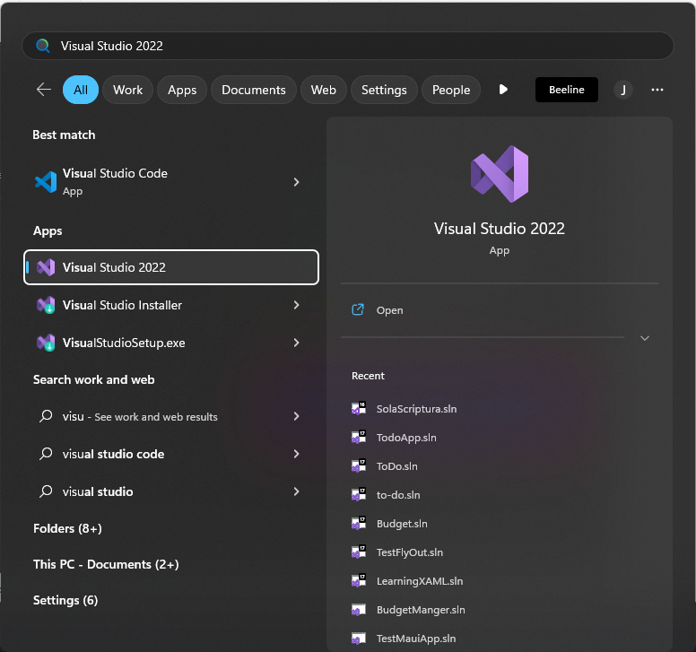

<p align="center">
  
</p>

<h3 align="center">:weight_lifting: ASP.Net MVC and Bootstrap Frameworks for Developing Web Applications</h3>

<p align="center">
  Welcome to the ASP.Net MVC and Bootstrap seminar/training.
</p>

## :wrench: Requirements
- [x] 1. Visual Studio Community 2022
  - [Download Link](https://visualstudio.microsoft.com/vs/community/)
- [x] 2. SQL Server Management Studio (SSMS)
  - [Donwload Link](https://learn.microsoft.com/en-us/sql/ssms/download-sql-server-management-studio-ssms?view=sql-server-ver16)
- [x] 3. SQL Server Management Studio Express
  - [GUIDE](https://www.sqlshack.com/how-to-install-sql-server-express-edition/)
  - [Download Link](https://www.microsoft.com/en-us/sql-server/sql-server-downloads)
- [x] 4. [Somee](https://somee.com/doka) account
- [ ] 5. GitHub Account (Not Required but good to have)

# :clock10: First Session

<p align="center">
  
  
</p>

<h3 align="center">1st Session - ASP.NET MVC and Bootstrap/Bootswatch</h3>

<p align="center">
  We'll spend our first session learning about the visual studio, ASP.NET MVC and how to implement bootstrap
  <br>
</p>

## :bulb: Scope
- [x] I. Installing Visual Studio
  - Selecting the right packages and plugins
- [x] II. Creating your first ASP.NET MVC solution
  - Exploring ASP.NET MVC solution
- [x] III. Implementing [Bootstrap/Bootswatch](https://bootswatch.com/3/)
- [x] IV. Your first custom page
- [x] V. Creating new page

## :wrench: I. Installing Visual Studio
- [ ] Download [Visual Studio Community 2022](https://visualstudio.microsoft.com/vs/community/)
- [ ] After installing, open Visual Studio Installer 

  

- [ ] Modify your Visual Studio Comunity 2022

  

- [ ] Check ASP.NET web development, Data storage processing

  
  

- [ ] Go to Individual Components and check ".NET Framework 4.7.2 SDK" and ".NET Framework 4.7.2 targeting pack" then click modify 

  


## :test_tube: II. Creating your first ASP.NET MVC solution
> For this example, we'll be creating a web site application for this seminar. We'll be adding our seminar poster into our application and use bootstrap to design it.

- [ ] Open Visual Studio and click on "Create a new project"

  
  

- [ ] Select ASP.NET Web Application (.Net Framework) and click next

  

- [ ] Create a name for your solution and click create
  > :warning: Note: Framework should be ".NET Framework 4.7.2"

  

- [ ] Select MVC and hit Create

  

- [ ] Wait for the creation of your new solution to open before pressing F5 or selecting the IIS Express option at the window's top to run your solution.

  

- [ ] After Executing your solution, your web application will be automatically open in your selected browser.

  

### :bus: MVC TOUR
> The MVC architectural pattern has existed for a long time in software engineering. All most all the languages use MVC with slight variation, but conceptually it remains the same.

>MVC stands for Model, View, and Controller. MVC separates an application into three components - Model, View, and Controller.

<p align="center">
  
</p>

- **Model:** Model represents the shape of the data. A class in C# is used to describe a model. Model objects store data retrieved from the database. **Model represents the data.**

- **View:** View in MVC is a user interface. View display model data to the user and also enables them to modify them. View in ASP.NET MVC is HTML, CSS, and some special syntax (Razor syntax) that makes it easy to communicate with the model and the controller. **View is the User Interface.**

- **Controller:** The controller handles the user request. Typically, the user uses the view and raises an HTTP request, which will be handled by the controller. The controller processes the request and returns the appropriate view as a response. **Controller is the request handler.**

## :art: III. Implementing [Bootstrap/Bootswatch](https://bootswatch.com/3/)
> It's quite simple to change the web application's theme. You can use a variety of free and downloadable CSS files that are available online.

>We'll modify our website's bootstrap theme as an example. Go to the bootstrap.min.css file in the Content folder to check the bootstrap version first. In this instance, bootstrap 3.4.1 is used in our solution.

> [You will be taken to the bootstrap version 3.4.1 after clicking this](https://bootswatch.com/3). You can obtain the CSS for your chosen theme from this website.

> Download the bootstrap.css and bootstrap.min.css and paste it on your Content folder. Note: These file name are already existing in this folder, Overwrite it to proceed changing the theme.

> Execute your solution.
  

## :page_facing_up: IV. Your first custom page
> We need to modify the home page and add the image of the seminar.

> Go to Views/Home/Index.cshtml and add the image code

```diff
@{
    ViewBag.Title = "Home Page";
}

<div class="jumbotron" style='background-image: url("~/Image/poster.png")'>
    <h1>ASP.NET MVC And Bootstrap for developing Web Applications</h1>
    <p class="lead">Welcome to ASP.NET MVC and Bootstrap Seminar</p>
    <p><a href="https://asp.net" class="btn btn-primary btn-lg">Learn more &raquo;</a></p>
</div>
+ 
```

> Code to add image in cshtml

```html

```

## :scroll: V. Creating new page
> Follow these instructions to create a new page in MVC.

- [ ] You'll locate the solution explorer on the right side of your visual studio. Right-click the "Controller" folder, select Add, and then select Controller.

  

- [ ] A new form will popup. Select MVC 5 Controller - Empty and click Add.

  

- [ ] Type in your controller's name. The text "[CHANGEME]" should be changed to your initials. Hit Enter and wait for your new controller to load.

  

  ```cs
  using System;
  using System.Collections.Generic;
  using System.Linq;
  using System.Web;
  using System.Web.Mvc;

  namespace LearningMVC.Controllers
  {
      public class JLEPageController : Controller
      {
          // GET: JLEPage
          public ActionResult Index()
          {
              return View();
          }
      }
  }
  ```

- [ ] On your controller, right click inside the index method and click add view.

  

- [ ] Select MVC 5 View and click add

  

- [ ] New window will open. Set your view name to "Index" and click add. 

  

- [ ] Wait for the new view to load.

  ```cshtml
  
  @{
      ViewBag.Title = "Index";
  }

  <h2>Index</h2>
  ```

# :clock2: Second Session

<p align="center">
  
</p>

<h3 align="center">2nd Session - ASP.NET MVC and Bootstrap/Bootswatch</h3>

<p align="center">
  For the second session, Databases (tables, stored procedures, etc) and deploying the visual studio solution and database to somee.com.
</p>

## :bulb: Scope
- [x] :hammer_and_wrench: I. Installing SSMS and SSMS Express
- [x] :minidisc: II. Creating new datase using SQL Sever Management Studio
- [x] :arrows_clockwise: III. Connecting your web application to your database.
- [x] :computer: IV. Displaying data from database to web application

## :hammer_and_wrench: I. Installing SSMS and SSMS Express
- [ ] You must first install SSMS (SQL Server Management Studio) in order to start managing databases. 
  [Donwload SSMS](https://learn.microsoft.com/en-us/sql/ssms/download-sql-server-management-studio-ssms?view=sql-server-ver16) and install.

- [ ] You must also install SSMS Express.
  - [ ] [GUIDE](https://www.sqlshack.com/how-to-install-sql-server-express-edition/) : Follow this guide to install SSMS Express. 
    
    >:exclamation: NOTE : Use the basic Installation Type.
    
    

  - [ ] [Download Link](https://www.microsoft.com/en-us/sql-server/sql-server-downloads)

- [ ] After installing SSMS and SSMS Express. open your SSMS by typing "SSMS" in your windows search.
  
  

- [ ] SSMS will require you to connect to your database. Select the drop down on your SQL Server window and select "Browse for more".
  
  

- [ ] Collapse the database engine and select any server under it and click "ok".
  
  

- [ ] Click connect on your SQL Server window
  
  
  
> Congrats, you are currently logged into your local machine's database.

:minidisc: II. Creating new datase using SQL Sever Management Studio
- [ ] On your SSMS, right click the Databases and click New Datase.
  
  

- [ ] Create a name for your database and click "OK"

  

- [ ] Creating new table in your database.

```sql
CREATE TABLE [dbo].[tblnames](
	[NameID] [int] IDENTITY(1,1) NOT NULL,
	[firstname] [nvarchar](50) NULL,
	[lastname] [nvarchar](50) NULL,
	[CreatedDate] [datetime] NULL
) ON [PRIMARY]
GO
```

- [ ] Inserting data in table

```sql
-- ENABLE INSRTING OF ID
SET IDENTITY_INSERT [dbo].[tblnames] ON 

-- SCRIPT TO INSERT DATA
INSERT [dbo].[tblnames] ([NameID], [firstname], [lastname], [CreatedDate]) VALUES (1, N'Juan', N'Dela Cruz', CAST(N'2023-03-20T14:33:48.793' AS DateTime))
INSERT [dbo].[tblnames] ([NameID], [firstname], [lastname], [CreatedDate]) VALUES (2, N'John', N'Doe', CAST(N'2023-03-20T15:23:54.870' AS DateTime))
```

- [ ] Selecting data in table

```sql
-- GET ALL THE DATA IN TBLNAMES
SELECT * FROM TBLNAMES
```
- OUTPUT

  

- [ ] Deleting data in table

```sql
DELETE [CHANGEME_TO_TABLE_NAME] WHERE 1=1

-- DELETE DATA IN TBLNAMES
DELETE [DBO].[TBLNAMES] WHERE [FIRSTNAME] = 'Jomiel'
```

## :arrows_clockwise: III. Connecting your web application to your database.
> We will now link our web application to the newly built database.

- [ ] Open your Project on your Visual Studio.

- [ ] Go to your solution explorer, right click on Model, click add and click new item.

  

- [ ] Under C#, click Data, select ADO.NET Entity Data Model and add name for your database model then click add.

  

- [ ] Select EF Designer from database and click next.

  

- [ ] Click new connection

  

- [ ] Enter server name. You can check your server name in your SSMS

  

  - [ ] Go to SSMS and copy the server name and paste it to visual studio connection properties

    

  - [ ] Paste the server name, select database name and click OK.

    

- [ ] Your entity data model wizard will be automatically updated. Click next.

  

- [ ] Select Entity Framwork 5.0 and click next

  

- [ ] Put a check on tables and click finish.

  

- [ ] The model you can see below will be created.

  

> Congratulations, your web application and database are now connected.

## :computer: IV. Displaying data from database to web application
 > We will now display the data from the database table "tblname" to the page that we previously created. 

- [ ] Go to solution explorer on your visual studio and open the controller that you created.

  

- [ ] Modify the code on your controller

  ```diff
  using System;
  using System.Collections.Generic;
  using System.Linq;
  using System.Web;
  using System.Web.Mvc;
  + // Code to include your data model that you previously created
  + using LearningMVC.Models;

  namespace LearningMVC.Controllers
  {
      public class JLEPageController : Controller
      {
          // GET: JLEPage
          public ActionResult Index()
          {
  +            // Instantiate the database Entity
  +            MVCSEMINARDBEntities MVC = new MVCSEMINARDBEntities();

  +            // get all the data from your database tblname
  +            var data = from name in MVC.tblnames select name;
  -            return View();
  +            // return the view with the data
  +            return View(data);
          }
      }
  }
  ```

- [ ] Go to the view of this method by right clicking the method and clicking the "Go to View".

- [ ] Modify your View Page

```diff
+@model IEnumerable<LearningMVC.Models.tblname>
@{
    ViewBag.Title = "Index";
}

<h2>Index</h2>

+@foreach(LearningMVC.Models.tblname names in Model)
+{
+    <h1>@names.firstname</h1>
+}
```


## Code to push update
```
git add .
git commit -m "update"
git push -u origin main
```