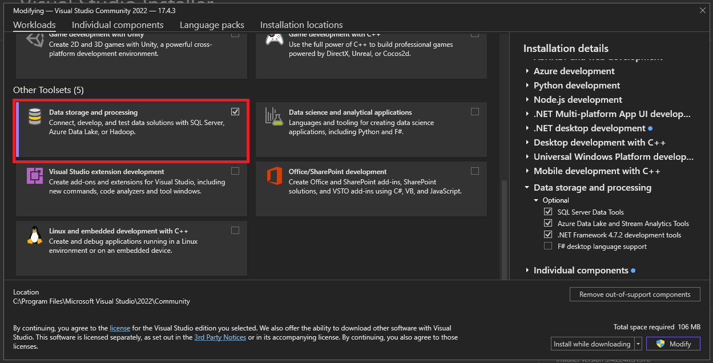

  

<h3 align="center">:notebook: ASP.Net MVC and Bootstrap Frameworks for Developing Web Applications</h3>

  Welcome to the ASP.Net MVC and Bootstrap seminar/training.

## :wrench: Requirements
- [x] 1. Visual Studio Community 2022
  - [Download Link](https://visualstudio.microsoft.com/vs/community/)
- [x] 2. SQL Server Management Studio (SSMS)
  - [Donwload Link](https://learn.microsoft.com/en-us/sql/ssms/download-sql-server-management-studio-ssms?view=sql-server-ver16)
- [x] 3. SQL Server Management Studio Express
  - [GUIDE](https://www.sqlshack.com/how-to-install-sql-server-express-edition/)
  - [Download Link](https://www.microsoft.com/en-us/sql-server/sql-server-downloads)
- [x] 4. [Somee](https://somee.com/doka) account
- [ ] 5. GitHub Account (Not Required but good to have)

# :clock10: First Session

  
  

<h3 align="center">1st Session - ASP.NET MVC and Bootstrap/Bootswatch</h3>

  We'll spend our first session learning about the visual studio, ASP.NET MVC and how to implement bootstrap
   

## :bulb: Scope
- [x] I. Installing Visual Studio
  - Selecting the right packages and plugins
- [x] II. Creating your first ASP.NET MVC solution
  - Exploring ASP.NET MVC solution
- [x] III. Creating your first custom page
- [x] IV. Implementing [Bootstrap/Bootswatch](https://bootswatch.com/)

## :man_technologist: I. Installing Visual Studio
- [ ] Download [Visual Studio Community 2022](https://visualstudio.microsoft.com/vs/community/)
- [ ] After installing, open Visual Studio Installer 

  

- [ ] Modify your Visual Studio Comunity 2022

  

- [ ] Check ASP.NET web development, Data storage processing and click Modify

  
  

## :test_tube: II. Creating your first ASP.NET MVC solution
> For this example, we'll be creating a web site application for this seminar. We'll be adding our seminar poster into our application and use bootstrap to design it.

- [ ] Open Visual Studio and click on "Create a new project"

  
  

# :clock2: Second Session

  

<h3 align="center">2nd Session - ASP.NET MVC and Bootstrap/Bootswatch</h3>

  For the second session, Databases (tables, stored procedures, etc) and deploying the visual studio solution and database to somee.com.

## :bulb: Scope

